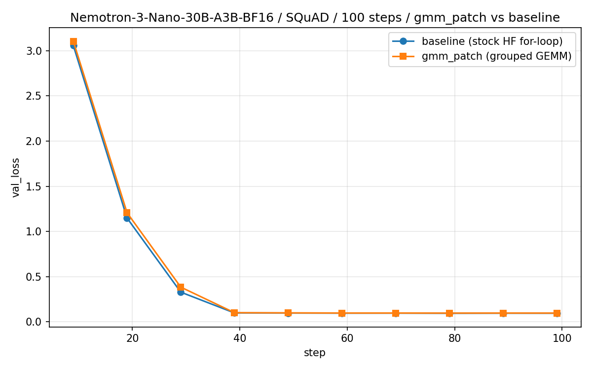

# Nemotron-3-Nano MoE MFU @ 19.7% on 8×H100

A reproducible repo for the blog post on hitting ~19.7% MFU on
[nvidia/NVIDIA-Nemotron-3-Nano-30B-A3B-BF16](https://huggingface.co/nvidia/NVIDIA-Nemotron-3-Nano-30B-A3B-BF16)
(30B params, 3B active, 128-expert MoE) using NVIDIA
[NeMo Automodel](https://github.com/NVIDIA-NeMo/Automodel) with a batched
grouped-GEMM MoE implementation on top of the stock HuggingFace model code.

## The number

**19.68% average MFU** (3491 TFLOP/s/GPU against a 989 TFLOP/s H100 dense-BF16
peak), measured over 5 independent runs — mean 19.684%, stdev 0.042pp, range
19.64–19.74%. Each run does 10 measured iterations after 5 warmup iterations
at seq_len=20480, MBS=1, `torch.compile(mode="default")`, Adagrad, bf16.
Iteration time is 2.241 s (stdev 5 ms). See
[`results/mfu_bench.json`](results/mfu_bench.json) for the latest run's
breakdown.

FLOPs come from NVIDIA's own
[`nemo_automodel/components/utils/flops_utils.py`](https://github.com/NVIDIA-NeMo/Automodel/blob/6cb5804c860e96d92c531c741efa69706505fbd6/nemo_automodel/components/utils/flops_utils.py)
(`nemotronh_flops` → `get_flops_formula_for_hf_config`), pinned at commit
[`6cb5804c`](https://github.com/NVIDIA-NeMo/Automodel/commit/6cb5804c860e96d92c531c741efa69706505fbd6).
[`patch/flops_utils.py`](patch/flops_utils.py) is a byte-identical copy of
that file, bind-mounted over the container's older copy (the stock
`25.11` image predates the `NemotronHConfig` registration), so every
reproduction here uses the exact same formula NVIDIA uses.

The patch is a functional no-op, verified by overlaying validation loss curves
for a 100-step SQuAD fine-tune with and without the patch:



Max absolute Δval_loss at matching steps: **0.059** (≈11% of the mean val_loss
— within run-to-run noise for a 100-step fine-tune).

## Repo layout

```
configs/
  mfu_bench.yaml          # seq=20480, MBS=1, Adagrad, compile — the 19.7% MFU run
  squad_gmm.yaml          # SQuAD fine-tune with gmm_patch, 100 steps (correctness)
  squad_baseline.yaml     # SQuAD fine-tune without the patch, 100 steps (correctness)
patch/
  gmm_patch.py            # ~160 lines: replaces NemotronHMOE.moe() for-loop
                          # with batched grouped_gemm + transformer_engine permute
  flops_utils.py          # byte-identical copy of NVIDIA's upstream flops_utils.py
                          # (pinned at commit 6cb5804c), bind-mounted over the
                          # container's older copy for reproducible MFU numbers
scripts/
  _common.sh              # shared docker run wrapper (sourced by the run_* scripts)
  run_mfu_bench.sh        # 15-step benchmark run → results/mfu_bench.json
  run_squad_gmm.sh        # 100-step SQuAD fine-tune with patch
  run_squad_baseline.sh   # 100-step SQuAD fine-tune without patch
eval/
  plot_squad_val_curves.py  # overlay the two val curves → comparison PNG
results/
  mfu_bench.json          # benchmark output (most recent run: 19.64% MFU,
                          #                   5-run mean: 19.68% ± 0.04pp)
  squad_gmm/
    training.jsonl        # per-step train loss (100 records)
    validation.jsonl      # val loss every 10 steps (10 records)
  squad_baseline/
    training.jsonl
    validation.jsonl
  squad_val_loss_comparison.png   # the plot above
```

## Prerequisites

- 8× H100 80GB (or equivalent). The benchmark also runs on fewer GPUs via
  `NGPUS=<n>` but the headline number is the 8-GPU one.
- Docker with NVIDIA Container Toolkit.
- Internet access for the first run (downloads ~60 GB for the model and ~100 MB
  for SQuAD from HuggingFace).
- ~120 GB free disk for the HF cache (set `HF_CACHE_DIR=/path/with/space` to
  override).

All other dependencies — PyTorch, Automodel, `grouped_gemm`,
`transformer_engine` — ship in the
[`nvcr.io/nvidia/nemo-automodel:25.11`](https://catalog.ngc.nvidia.com/orgs/nvidia/containers/nemo-automodel)
image. No `pip install` required.

## Reproduce

```bash
# MFU benchmark (~5 min incl. compile warmup; writes results/mfu_bench.json)
bash scripts/run_mfu_bench.sh

# Correctness: SQuAD fine-tune with and without patch (~5 min each;
# writes results/squad_{gmm,baseline}/)
bash scripts/run_squad_baseline.sh
bash scripts/run_squad_gmm.sh

# Plot the comparison (writes results/squad_val_loss_comparison.png)
python3 eval/plot_squad_val_curves.py
```

### Common overrides

All scripts use these env vars (see [`scripts/_common.sh`](scripts/_common.sh)):

| Var | Default | Purpose |
|---|---|---|
| `DOCKER_IMAGE` | `nvcr.io/nvidia/nemo-automodel:25.11` | Container |
| `NGPUS` | `8` | Trainer world size |
| `HF_CACHE_DIR` | `~/.cache/huggingface` | Model + dataset cache |
| `EXTRA_MOUNT` | _(unset)_ | Extra read-only bind mount, e.g. `/mnt/weights` if you have a local mirror of the model and want to pass `--model.pretrained_model_name_or_path=/mnt/weights/Nemotron-3-Nano-30B-A3B-BF16` on the command line |

Example: run on 4 GPUs with weights from a local NAS:

```bash
NGPUS=4 EXTRA_MOUNT=/mnt/nas/models bash scripts/run_mfu_bench.sh \
    --model.pretrained_model_name_or_path=/mnt/nas/models/NVIDIA-Nemotron-3-Nano-30B-A3B-BF16
```

## What the patch actually does

```text
NemotronHMOE.moe (stock HF)                GroupedMoEExperts.forward (gmm_patch)

for i in range(128):                       te_perm.moe_permute(x, indices)
  mask_i = one_hot(indices)[i]             ops.gmm(x, up_weights)          # all 128 at once
  idx = where(mask_i)                      act_fn(h)
  if idx.numel() > 0:                      ops.gmm(h, down_weights)        # all 128 at once
    h = experts[i](x[idx])                 te_perm.moe_unpermute(h, indices, weights)
    out.index_add_(0, idx, h * w[idx])
```

See [`patch/gmm_patch.py`](patch/gmm_patch.py) for the full implementation. The
outer `NemotronHMOE.forward` (gate + shared-expert path) is unchanged — the
patch only touches the 128-iteration for-loop. That's why the validation
curves overlap.

## Hardware used for the numbers in this repo

- 8× NVIDIA H100 80GB HBM3 (SXM), NVLink
- NVIDIA driver 535.x, CUDA 13.0
- Docker image `nvcr.io/nvidia/nemo-automodel:25.11` (PyTorch 2.9.0a0)
